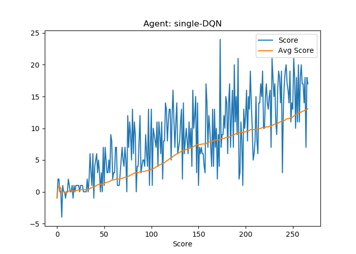
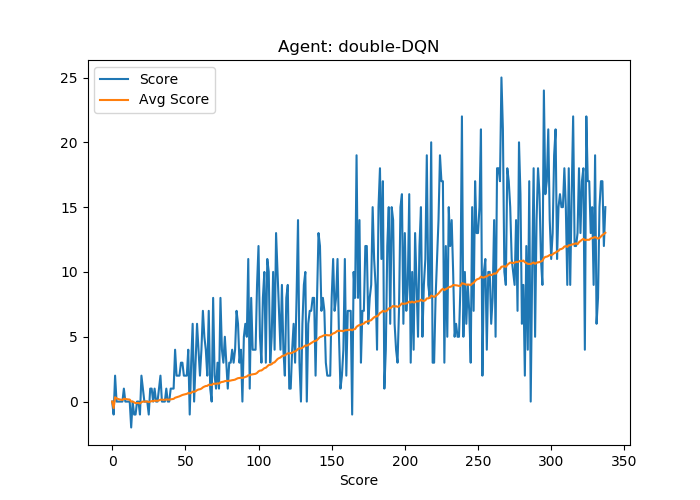
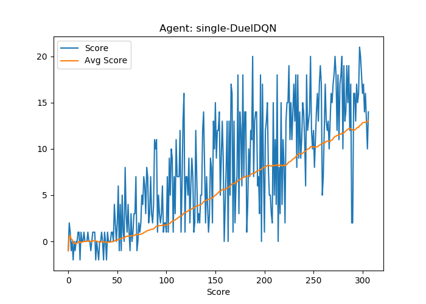
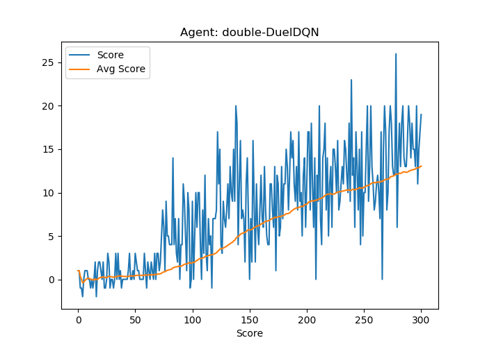

# Banana-Agent Report
This agent was developed as a solution to Project 1 of Udacity Deep Reinforcement Learning Nanodegree, with this short report giving a short summary of the implemented learning algorithm, chosen hyperparameters, and architecture of chosen neural networks, as well as showcasing the obtained results.

# Implementation Details
## Learning Algorithm
I've chosen to implement a DQN algorithm with the following three extensions discussed during the course:
* Double DQN (DDQN)
* Prioritized Experience Replay (PER)
* Dueling DQN

### DQN
The function `Q(s,a)` essentially tells the agent the value of performing a action `a` given a state `s`, and with Deep Q-Learning (DQN) we use deep learning to approximate this Q function. In order for us to stably train such a network, we need to do two things;

* Experience replay: we store previous actions in a replay buffer from which we sample when training this network. This reduces the high correlation between samples we would have if we trained on samples as they are observed sequentially.

* Target network: when training the network, we employ two networks (a `target` network and a `local` network). We use the target network to retrieve Q values, and the local network for training - and then occasionally we sync the two networks. This ensures that the network is not chasing a moving target, as would be the case if we used only one network.

### Double DQN
Traditional DQN is known to overestimate `Q` values when updating the local network weights. In practise it has been shown that this can be alleviated by using one set of network parameters (i.e. the local network) for finding the best action, and another set (i.e. the target network) for evaluating that action - this is what we call Double DQN.

### Prioritized Experience Replay
The idea in PER is that instead of uniformly sampling from our replay buffer, we assign each experience a priority according to the magnitude of its TD error, ensuring that these samples will be sampled more frequently. To implement this we store experiences in a sum tree data structure, which allows for efficient sampling based on priority. I found the following immensely helpful for understanding this concept: [per explained](https://jaromiru.com/2016/11/07/lets-make-a-dqn-double-learning-and-prioritized-experience-replay/).

### Dueling DQN
In estimating our `Q` values, we can create a network that estimates a state value `V(s)` (i.e. the value of being in state s) and advantage `A(s,a)` (advantage for each action `a` in `s`), and combines those into our final `Q` value. By decoupling the final estimation like this, we intuitively allow the network to learn which states are or are not valueable without explicitly having to learn the effect of each action in that state.

## Hyperparameters
The hyperparameters are chosen as follows (inspired by others, I have not played with tuning these):

```
CAPACITY = int(5e4)   # Prioritized Replay Capacity. Size chosen based on available RAM.
BATCH_SIZE = 64       # Batch Size
GAMMA = 0.99          # Discount
TAU = 1e-3            # Soft update of target network
LR = 5e-4             # Learning rate
UPDATE_FREQUENCY = 4  # Frequency for training network
```

Beyond those parameters, I've trained with the following:
```
episodes=50000  # Maximum number of episodes
eps_start=1.0   # Starting epsilon value
eps_end=0.001   # Final epsilon value
eps_decay=0.97  # Epsilon decay
thr_score=13.0  # When the game is won
```

## Neural Networks
In the case of discrete state space, the basic neural network structure is simply a set of fully connected layers:
```
x = self.relu(self.fc1(state))
x = self.relu(self.fc2(x))
x = self.output(x)
```

For the pixel space, I stack 4 consecutive frames, so that the state space has the shape (N=batch_size, C=channels, F=frames, H=height, W=width), i.e. (64, 3, 4, 84, 84). Since we have 4 frames, I then use a 3D convolutional network on the last three dimensions of the state - the temporal dimension could be incorportated into the network in several other ways, but I found this to be the easiest, and it seems to work.

```
x = self.relu(self.bn1(self.conv1(state)))
x = self.relu(self.bn2(self.conv2(x)))
x = self.relu(self.bn3(self.conv3(x)))
x = x.reshape(x.size(0), -1)
x = self.relu(self.fc1(x))
x = self.output(x)
```

# Results
## Discrete State Space
<p float="left">
  
   
  
  
</p>

## Pixel State Space

# Future Work
The current implementation includes DDQN, PER and Dueling DQN, which constitute 3 out of the 6 DQN extensions of the [Rainbow agent](https://arxiv.org/abs/1710.02298). The last 3 extensions would be natural starting points for future improvements to this implementation:
[] (Multi-step bootstrap targets)[https://arxiv.org/abs/1602.01783]
[] (Distributional DQN)[https://arxiv.org/abs/1707.06887]
[] (Noisy DQN)(https://arxiv.org/abs/1706.10295)